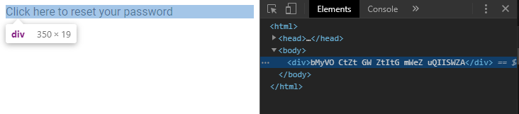

# 🦊 Kitsune

Kitsune generates randomized substitution cipher fonts, useful for bypassing static analysis for red team/penetration testing engagements. Scanners will see random ASCII characters, but clients will render human-readable text.

### Installation

```console
$ git clone https://github.com/disasterbyte/kitsune.git && cd kitsune
$ pip install .
```

### Usage

```console
$ kitsune -h
usage: kitsune [-h] [-c TEXT] [-o FILE] [-w] filename

positional arguments:
  filename    input filename

optional arguments:
  -h, --help  show this help message and exit
  -c TEXT     generate ciphertext
  -o FILE     output file name
```

Generate a cipher font from an existing TrueType file, which will create `.ttf` and `.ttx` files. 

```console
$ kitsune Roboto.ttf -o Sample 
[+] Loading source font...
[+] Generating Sample.ttx file...
[+] Generating Sample.ttf file...
```

You can generate ciphertex from an existing `.ttx` file, providing a string as a command-line argument.

```console
$ kitsune Sample.ttx -c "Click here to reset your password"

bMyVO CtZt GW ZtItG mWeZ uQIISWZA
```


The generated font can be embedded into documents or loaded remotely in HTML emails or web pages:


